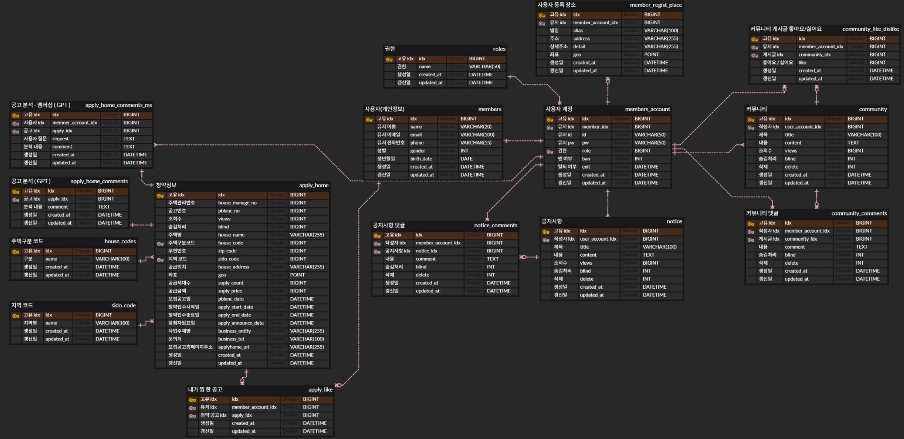
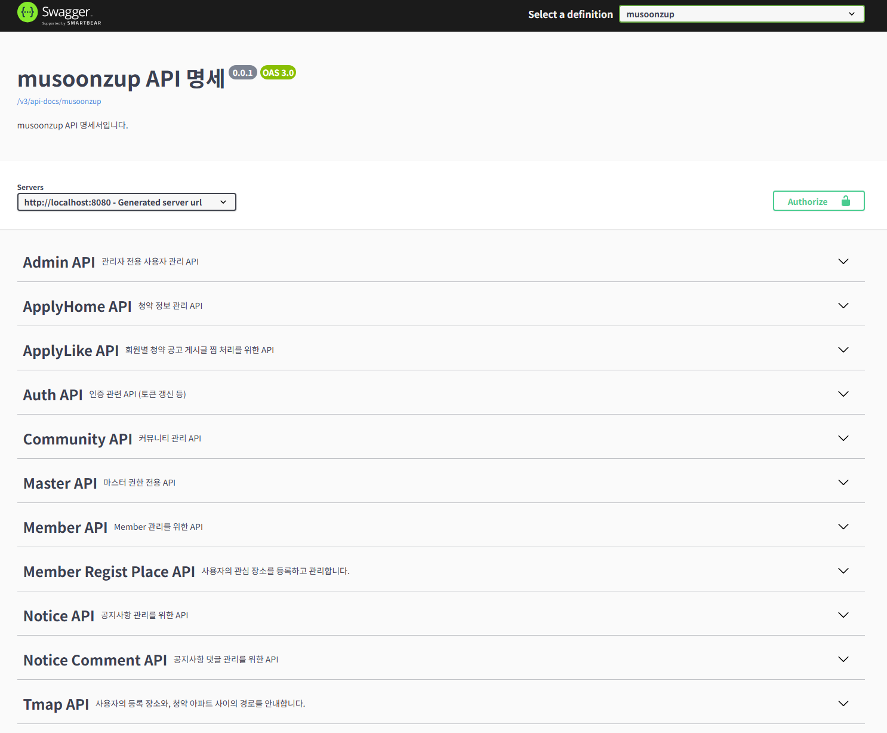

# 🏠 **MusoonZupZup - 무순위 청약 정보 플랫폼**

---

## 🎯 **프로젝트 개요**

> **"줍줍(무순위 청약) 정보를 보다 쉽고 빠르게!"**

기존 청약 시스템은 청약통장이 필요한 경우가 많아 실수요자 외에는 진입 장벽이 높습니다.  
하지만 **무순위 청약(줍줍)** 은 **청약통장 없이 누구나 신청 가능**하여 새로운 투자 기회로 주목받고 있습니다.  
본 프로젝트는 이러한 정보를 **쉽고 효율적으로 탐색하고 판단할 수 있도록 돕는 플랫폼**을 목표로 합니다.

## 🛠️ **주요 기능**

### 📋 무순위 청약 정보 열람
- 공공 데이터를 바탕으로 무순위 청약 공고 목록을 제공합니다.
- 위치, 분양가, 세대 수, 마감일 등 공고 상세 정보를 확인할 수 있습니다.

### ❤️ 청약 공고 즐겨찾기
- 관심 있는 청약 공고를 찜해놓고 나중에 다시 쉽게 확인할 수 있습니다.
- 찜한 공고는 마이페이지에서 확인 가능합니다.

### 💬 자유 게시판 기능
- 사용자들 간 정보를 공유할 수 있는 자유 게시판을 제공합니다.
- 글 작성, 수정, 삭제, 댓글 작성이 가능합니다.

### 🧠 AI 기반 분석
- GPT를 활용한 주변 시세 및 인프라 분석 기능을 제공합니다.
- 멤버십 사용자는 GPT에게 무제한 질문이 가능합니다.

### 🏅 멤버십 기능 (프리미엄 사용자 전용)
- 일반 사용자보다 더 많은 기능과 질문 기회를 제공하는 **멤버십 제도**를 운영합니다.
- 멤버십 사용자는 **GPT 분석 기능을 무제한으로 이용**할 수 있으며, 더 풍부한 데이터 기반 질문이 가능합니다.
- 향후 멤버십 등급별 기능 확장도 고려된 구조로 설계되었습니다.

### 📍 내 장소 등록 및 거리 비교
- 본가, 학원, 직장 등 자주 가는 장소를 최대 3곳까지 등록할 수 있습니다.
- 등록한 장소와 청약지 간의 자동차/도보/대중교통 경로를 조회할 수 있습니다.

### 📢 공지사항 확인
- 시스템 관련 공지사항을 확인할 수 있으며 댓글도 작성할 수 있습니다.

### 👤 회원 및 관리자 기능
- 회원가입, 로그인, 로그아웃, 마이페이지 기능 제공
- 관리자 및 마스터 권한자는 사용자 관리와 글 숨김 및 댓글 숨김이 가능합니다.

## 👨‍👩‍👧‍👦 **팀원 소개**

- 👨‍💻 정한슬 — 백엔드 & 프론트엔드 & 발표
- 🧑‍💻 박재환 — 백엔드 & DB 설계
- 👩‍💻 신해봄 — 백엔드 & 베타 테스트 & 영상 작업

## 🛠️ **기술 스택**

- 🖥️ **Backend**: Spring Boot, MySQL, MyBatis, Redis, Docker  
- 💻 **Frontend**: Vue.js, JavaScript, SCSS
- 🌐 **Open API**: Kakao Map Api, T-Map Api, Open Ai 

## ERD


## 🔗 **관련 링크**

- 📐 [Figma 와이어프레임 보기](https://www.figma.com/board/oiNWP1yNI0blErRgM71TmP/musoonzup?node-id=0-1&p=f)  
- 📊 [ERD 설계도 보기](https://www.erdcloud.com/d/5w4dttMHoGejnFLs9)  
- 💻 [Frontend GitLab Repo](https://lab.ssafy.com/ssafy_13th_18class/999_final/ssafy_home_final_chunghanseul_parkjaehwan_front)

## ⚙️ **설치 및 실행 방법**

### 🖥️ Backend
---
```bash
# 저장소 클론
git clone https://lab.ssafy.com/ssafy_13th_18class/999_final/ssafy_home_final_chunghanseul_parkjaehwan_shinhaebom.git

# 환경 설정 파일 생성 
# src/main/java/resources/application-email.properties
spring.mail.host=smtp.gmail.com
spring.mail.port=587
spring.mail.username=
spring.mail.password=
spring.mail.properties.mail.smtp.auth=true
spring.mail.properties.mail.smtp.starttls.enable=true

# 스키마 생성
# src/main/java/resources/SQL_Setting 참고
1. Schema.sql 실행
2. DB_UpdateApi실행방법.txt을 토대로 청약 정보 DB에 insert 작업 진행
```
```bash
# DB_UpdateApi실행방법.txt
사전 작업 
src/main/resources/SQL Setting 내부의 Schema.sql, InsertBasicInfo.sql 순으로 SQL 을 실행시켜 DB 테이블을 생성한다.

Data 채우기
[옵션 1]
Dump.sql 파일을 실행한다.
[옵션 2]
1. 압출을 푼다.
2. VSCode 를 활용해 프로젝트를 연다
2-1. npm i 키워드를 사용해 node module 을 다운로드 받는다.
3. node server.js 명령어를 사용해 프로젝트를 실행한다.
4. http://localhost:3000/api/open/call/update url 로 접속하여 DB 데이터를 생성한다.
```

```bash
# Docker 실행
# 1. Docker Desktop 실행
# 2. Redis 실행
docker-compose up -d
```

### 💻 Frontend
---
```bash
# 저장소 클론
git clone https://lab.ssafy.com/ssafy_13th_18class/999_final/ssafy_home_final_chunghanseul_parkjaehwan_front.git

npm install
npm run dev
```

## 📘 **API 명세서**

본 프로젝트의 API 문서는 Swagger를 통해 자동 생성되며, 전체 기능 흐름 및 요청/응답 형식을 직관적으로 확인할 수 있습니다.

- API 명세는 서버 실행 후 아래 경로에서 확인 가능합니다:  
  👉 `http://localhost:8080/swagger-ui/index.html`

- 주요 API 카테고리:  
  `청약 공고`, `찜 기능`, `회원 인증`, `자유게시판`, `공지사항`, `AI 분석`, `위치 기반 경로 탐색`, `관리자 기능` 등으로 구성되어 있습니다.

> ✅ Swagger를 통해 실시간으로 테스트하며 백엔드 API를 검증할 수 있어, 협업과 유지보수에 매우 효율적입니다.


## 🎬 시연 영상
아래 이미지를 클릭하시면 YouTube에서 실제 동작 시연 영상을 보실 수 있습니다.

[](https://www.youtube.com/watch?v=XRK3wkQiPXs)

